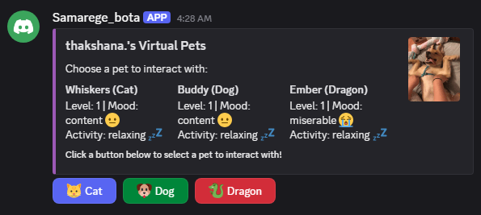
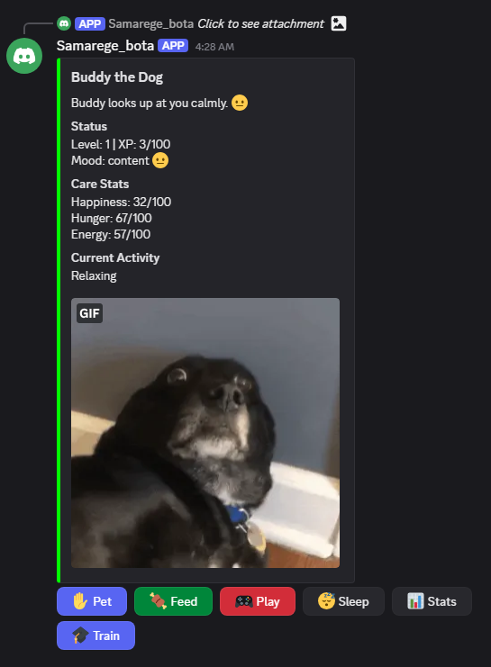
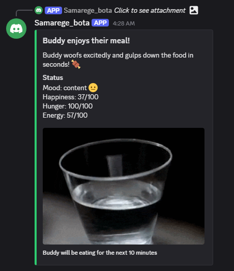

# 🐾 Discord Virtual Pet Bot

A fun and interactive **Discord bot** where users can play with virtual pets like a **cat**, **dog**, and **dragon** through clickable buttons and GIFs!



 

---

## 🌟 Features

- 👆 Clickable buttons to interact with virtual pets.
- 🐱🐶🐉 Three default pets: Whiskers (Cat), Buddy (Dog), Ember (Dragon).
- 🎭 Mood system with preset reactions (happy, content, miserable).
- 📸 Embedded GIFs or images of pets.
- 🔐 Ephemeral messages – responses are only visible to the clicking user.
- 🔧 Easily expandable with more pets or actions.

---

## 📦 Prerequisites

- Python 3.8+
- `discord.py` v2.x+
- A Discord Bot Token (via [Discord Developer Portal](https://discord.com/developers/applications))

---

## 🔧 Installation

```bash
# Clone the repository
git clone https://github.com/your-username/virtual-pet-bot.git
cd virtual-pet-bot

# (Optional) Create a virtual environment
python -m venv venv
source venv/bin/activate  # Windows: venv\Scripts\activate

# Install dependencies
pip install -U discord.py
